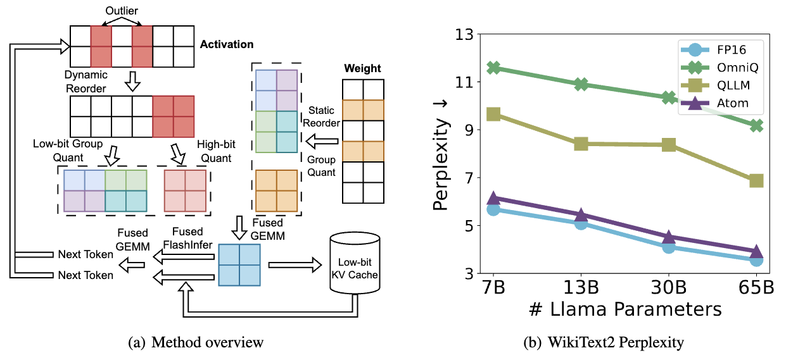
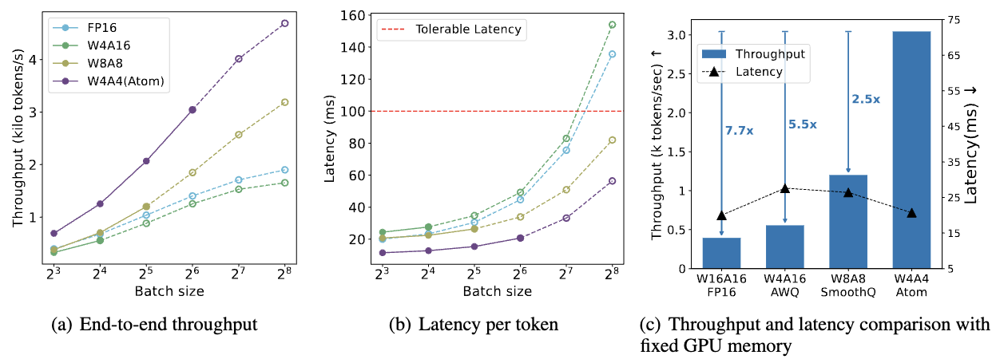

# Atom: Low-bit Quantization for Efficient and Accurate LLM Serving
[[paper](https://arxiv.org/abs/2310.19102)]



Atom is an accurate low-bit weight-activation quantization algorithm that combines (1) mixed-precision, (2) fine-grained group quantization, (3) dynamic activation quantization, (4) KV-cache quantization, and (5) efficient CUDA kernels co-design. This codebase utilizes [lm_eval](https://github.com/EleutherAI/lm-evaluation-harness.git) to evaluate perplexity and zero-shot accuracy on Llama models. And code segments from [SmoothQuant](https://github.com/mit-han-lab/smoothquant.git), [GPTQ](https://github.com/IST-DASLab/gptq.git), and [SparseGPT](https://github.com/IST-DASLab/sparsegpt.git) are integrated to reproduce results. Our kernels are modified based on previous version of [FlashInfer](https://github.com/flashinfer-ai/flashinfer).

The current release features:
* Simulated quantization process for accuracy evaluation.
* Perplexity and zero-shot accuracy evaluation
* Kernel performance evaluation

To do:
- [x] Release code for reproducing results.
- [ ] Release code for end-to-end throughput evaluation.
- [ ] Optimize kernel for different GPUs.

## Abstract
The growing demand for Large Language Models (LLMs) in applications such as content generation, intelligent chatbots, and sentiment analysis poses considerable challenges for LLM service providers. To efficiently use GPU resources and boost throughput, batching multiple requests has emerged as a popular paradigm; to further speed up batching, LLM quantization techniques reduce memory consumption and increase computing capacity. However, prevalent quantization schemes (e.g., 8-bit weight-activation quantization) cannot fully leverage the capabilities of modern GPUs, such as 4-bit integer operators, resulting in sub-optimal performance.
To maximize LLMs' serving throughput, we introduce Atom, a low-bit quantization method that achieves high throughput improvements with negligible accuracy loss. Atom significantly boosts serving throughput by using low-bit operators and considerably reduces memory consumption via low-bit quantization. It attains high accuracy by applying a novel mixed-precision and fine-grained quantization process. We evaluate Atom on 4-bit weight-activation quantization setups in the serving context. Atom improves end-to-end throughput by up to 7.73× compared to the FP16 and by 2.53× compared to INT8 quantization, while maintaining the same latency target.

## Installation
1. Run in container. Mount models.
```
docker pull nvidia/cuda:11.3.1-cudnn8-devel-ubuntu20.04
docker run -it --gpus all -v /PATH2MODEL:/model nvidia/cuda:11.3.1-cudnn8-devel-ubuntu20.04 /bin/bash
```
2. Clone this repo
```
git clone https://github.com/efeslab/Atom
cd Atom
```
3. Prepare environment
```
cd model
conda create -n atom python=3.10
conda activate atom
pip install -r requirements.txt
```
4. Compile kernels benchmarks (Optional)
```
cd kernels
apt install software-properties-common
apt-get update
add-apt-repository -y ppa:ubuntu-toolchain-r/test
apt-get update
apt install -y gcc-11 g++-11
mkdir build && cd build
cmake ..
make -j
```
## Usage
### Accuracy Evaluation
Below is an example script for running a W4A4 quantization using Atom. Before running this command, please download Llama model from [HuggingFace website](https://huggingface.co/models?sort=trending&search=llama) first.
We recommend downloading from [HuggyLlama](https://huggingface.co/huggyllama).
```
python model/llama.py /Path/To/Llama/Model wikitext2 \
    --wbits 4 --abits 4 --a_sym --w_sym \
    --act_group_size 128 --weight_group_size 128 --weight_channel_group 2 \
    --reorder --act_sort_metric hessian \
    --a_clip_ratio 0.9 --w_clip_ratio 0.85 \
    --keeper 128 --keeper_precision 3 --kv_cache --use_gptq \
    --eval_ppl --eval_common_sense
```
We also provide several scripts to reproduce our results in the paper.

To run our W4A4 perplexity evaluation, please execute
```
bash scripts/run_atom_ppl.sh /Path/To/Llama/Model
```

To get our W4A4 zero shot accuracy on common sense tasks, please execute
```
bash scripts/run_atom_zeroshot_acc.sh /Path/To/Llama/Model
```

To run our ablation study on different quantization optimizations, please run
```
bash scripts/run_atom_ablation.sh /Path/To/Llama/Model
```
### Efficiency Evaluation
We evaluate Atom on a RTX4090 GPU. Results below are executed in [cu113](https://hub.docker.com/layers/nvidia/cuda/11.3.1-cudnn8-devel-ubuntu20.04/images/sha256-052b3b515d9653f9c6e358e5b70f8bb9d75c17a8b2039055674dfa7caa970791?context=explore) docker container.

To get INT4 GEMM kernel result, please execute
```
cd kernels/build
./bench_gemm_i4_o16
```


Other kernel results can be found in [kernels/README.md](kernels/README.md), which can be reproduced similarly.

## Key Results
### Perplexity
* Atom achieves strong perplexity results across WikiText2, PTB and C4 datasets across on Llama models family.

### End-to-end throughput and latency
* Atom achieves up to 7.7x higher throughput with similar latency than `FP16` with a fixed GPU memory under serving scenario.


## Reference
If you find Atom is helpful to your research, please consider to cite our paper:
```
@article{zhao2023atom,
  title={Atom: Low-bit Quantization for Efficient and Accurate LLM Serving},
  author={Zhao, Yilong and Lin, Chien-Yu Lin and Zhu, Kan and Ye, Zihao and Chen, Lequn and Zheng, Size and Ceze, Luis and Krishnamurthy, Arvind and Chen, Tianqi and Kasikci, Baris},
  journal={arXiv},
  year={2023}
}
```

